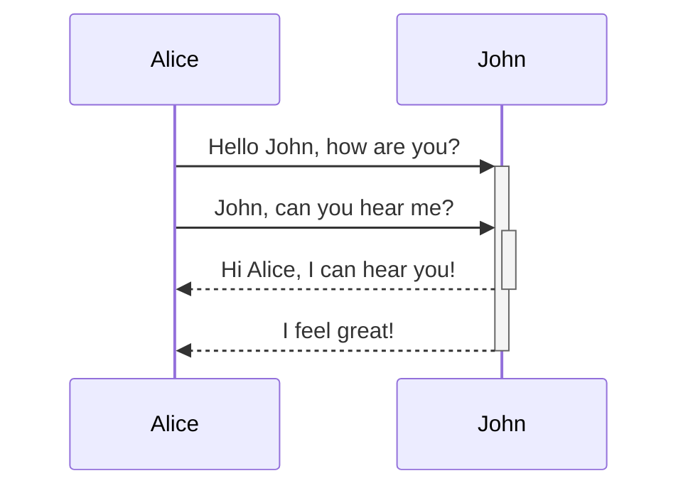
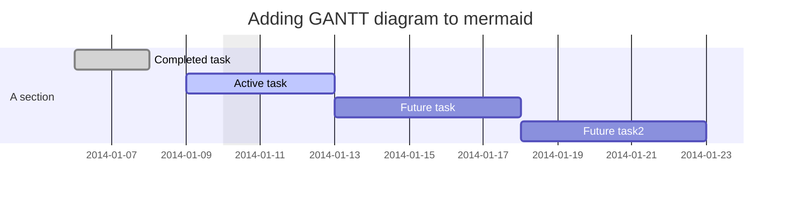
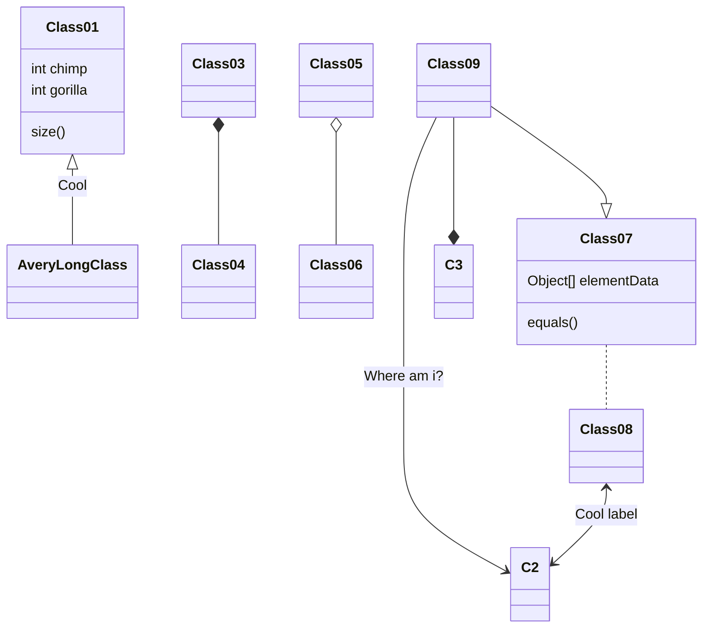
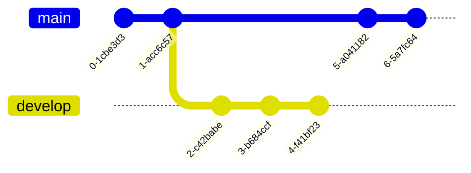
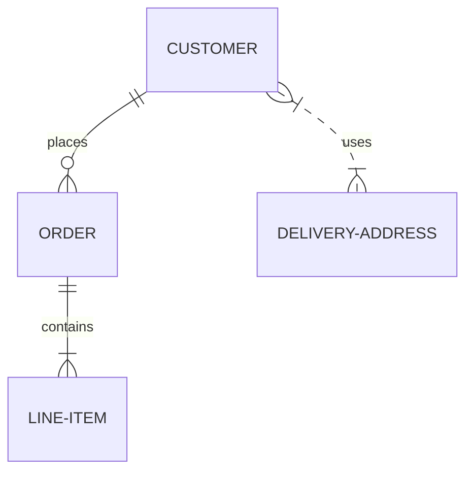
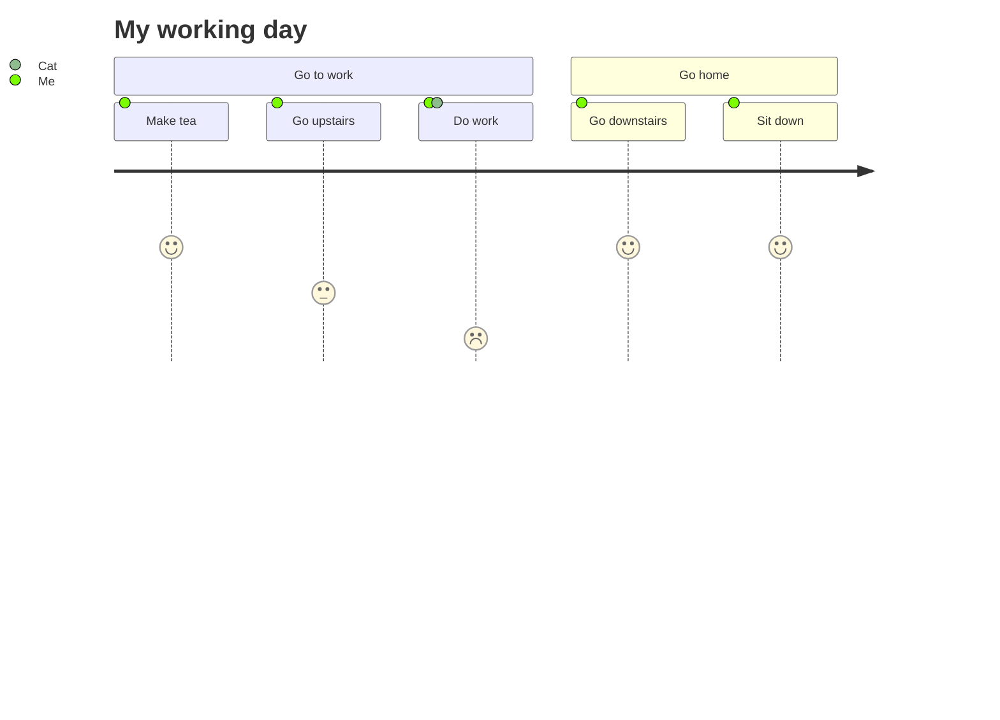
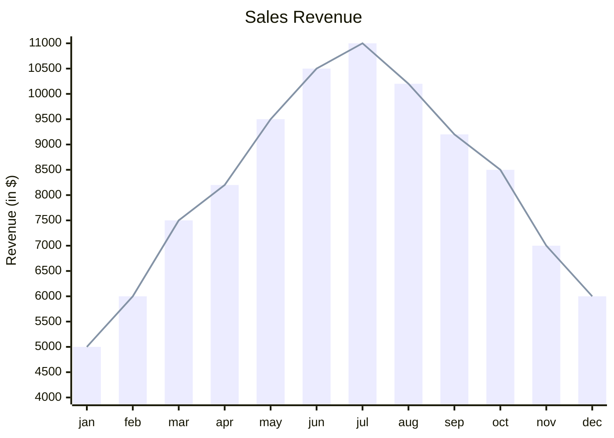
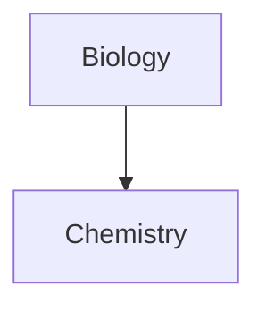
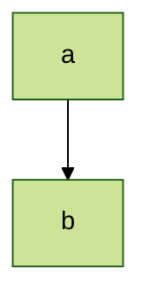

# markdown tutorial
## [Text](https://www.markdownguide.org/basic-syntax/#paragraphs-1)
### [Heading](https://www.markdownguide.org/basic-syntax/#paragraphs-1)
There are six different types of headings, from heading 1 to heading 6. 

Heading 1 has the biggest text among these headings. 

While heading 6 has the smallest text among these headings.

| Markdown	| HTML | Rendered Output |
| --------- | ---- | --------------- |
| # Heading level 1 | `<h1>Heading level 1</h1>` |	<h1>Heading level 1</h1> | 
| ## Heading level 2	| `<h2>Heading level 2</h2>` | <h2>Heading level 2</h2>	| 
| ### Heading level 3	| `<h3>Heading level 3</h3>` | <h3>Heading level 3</h3>	| 
| #### Heading level 4	| `<h4>Heading level 4</h4>` | <h4>Heading level 4</h4> |
| ##### Heading level 5	| `<h5>Heading level 5</h5>` | <h5>Heading level 5</h5> |
| ###### Heading level 6 | `<h6>Heading level 6</h6>`	| <h6>Heading level 6</h6> |

#### Alternative Syntax

| Markdown | HTML | Rendered Output |
| -------- | ---- | --------------- |
| Heading level 1 <br> ===============	| `<h1>Heading level 1</h1>` | <h1>Heading level 1</h1> |
| Heading level 2 <br> ---------------	| `<h2>Heading level 2</h2>` | <h2>Heading level 2</h2> |

> [!NOTE]
> + Don't forget to put one space between `#` and the first word.
> + `#` must be consecutive. For example, `## Heading 2` and `# # Heading 2` are **NOT** equivalent.

### [Paragraphs](https://www.markdownguide.org/basic-syntax/#paragraphs-1)
To create paragraphs, use a blank line to separate one or more lines of text.

| Markdown | HTML | Rendered Output |
| -------- | ---- | --------------- |
| I really like using Markdown. <br> <br> I think I'll use it to format all of my documents from now on.	| `<p>I really like using Markdown.</p> <p>I think I'll use it to format all of my documents from now on.</p>` | <p>I really like using Markdown.</p> <p>I think I'll use it to format all of my documents from now on.</p>
  
> [!NOTE]
> Unless the paragraph is in a list, don’t indent paragraphs with spaces or tabs.

### [Line Breaks](https://www.markdownguide.org/basic-syntax/#line-breaks)
To create a line break or new line (in html `<br>`), end a line with two or more spaces, and then type return.

| Markdown | HTML | Rendered Output |
| -------- | ---- | --------------- |
| This is the first line.  <br> And this is the second line. |	`<p>This is the first line.<br> And this is the second line.</p>`	 | <p>This is the first line.<br> And this is the second line.</p> |


> [!NOTE]
> Unlike C, one can ***NOT*** `\` to break a new line.

See the example on [Line Break Best Practices](https://www.markdownguide.org/basic-syntax/#line-break-best-practices)

## [Emphasis of text](https://www.markdownguide.org/basic-syntax/#emphasis)
### [Bold](https://www.markdownguide.org/basic-syntax/#bold)

| Markdown | HTML | Rendered Output |
| -------- | ----- | -------------- |
| `I just love **bold text**`. |	`I just love <strong>bold text</strong>`.	| I just love <strong>bold text</strong> |
| `I just love __bold text__.` | `I just love <strong>bold text</strong>.` | I just love <strong>bold text</strong>. |
| `Love**is**bold`	| `Love<strong>is</strong>` | Love**is**bold |

> [!NOTE]
> There don't exist this syntax. Such as `Love__is__bold`.

### [Italic](https://www.markdownguide.org/basic-syntax/#bold-and-italic)

| Markdown | HTML | Rendered Output |
| -------- | ---- | --------------- |
| `Italicized text is the *cat's meow*.` | `Italicized text is the <em>cat's meow</em>.`	| Italicized text is the <em>cat's meow</em>. |
| `Italicized text is the _cat's meow_.`	| `Italicized text is the <em>cat's meow</em>.`	| Italicized text is the <em>cat's meow</em>. | 
| `A*cat*meow` | `A<em>cat</em>meow` | A*cat*meow

> [!NOTE]
> There don't exist this syntax. Such as `A_cat_meow`.

### [Strikethrough](https://learn-markdown.github.io/)
Any word wrapped with two tildes (like `~~this~~`) will appear crossed out.

+ Example 1:

```
~~this~~
```

The rendered output looks like this:

~~this~~

### [Bold and Italic](https://www.markdownguide.org/basic-syntax/#bold-and-italic)

| Markdown | HTML |	Rendered Output |
| -------- | ---- | --------------- |
| `This text is ***really important***.` | `This text is <em><strong>really important</strong></em>.` | This text is <em><strong>really important</strong></em>.|
| `This text is ___really important___.` | `This text is <em><strong>really important</strong></em>.` |	This text is <em><strong>really important</strong></em> |
| `This text is __*really important*__.`	| `This text is <em><strong>really important</strong></em>.`	| This text is <em><strong>really important</strong></em> |
| `This text is **_really important_**.` | `This text is <em><strong>really important</strong></em>.` | This text is <em><strong>really important</strong></em> |
| `This is really***very***important text.`	| `This is really<em><strong>very</strong></em>important text.`	| This text is <em><strong>really important</strong></em> |

> [!NOTE]
> There don't exist this syntax. Such as `This is really___very__important text.`.

> [!NOTE]
> The order of the em and strong tags might be reversed depending on the Markdown processor you're using.

### [Subscript](https://docs.github.com/en/get-started/writing-on-github/getting-started-with-writing-and-formatting-on-github/basic-writing-and-formatting-syntax#styling-text)
Due to the feature of markdown.

+ some markdown language support some html (a kind of markup language) in some platform or app.

In Github, one can use `<sub>` tag along with `</sub>`.

### [Superscript](https://docs.github.com/en/get-started/writing-on-github/getting-started-with-writing-and-formatting-on-github/basic-writing-and-formatting-syntax#styling-text)
Due to the feature of markdown.

+ some markdown language support some html (a kind of markup language) in some platform or app.

In Github, one can use `<sup>` tag along with `</sup>`.

### Underline
I put this subsection under last of this section. Since the implementation of underline text in markdown are complicate and rough.

Due to the feature of markdown.

+ some markdown language support some html (a kind of markup language) in some platform or app. 

Thus, we may use the html tag to achieve this (or may not in some markdown languages and platforms or apps).

This artcile on [stackoveflow](https://stackoverflow.com/questions/3003476/get-underlined-text-with-markdown) covers a lot of way to underline texts with html tag.

### a long `-` in markdown, i.e. the character `--`[^10]
See a long `-` in markdown, i.e. the character `--`[^10]

### Keyboard input icon (kbd)

Since Github support one of html tag `<kdb>`, we can use it to show keyboard input icons.

+ Example 1:

```
<kbd>CTRL</kbd> + <kbd>L</kbd>
```

will be rendered output like this:

<kbd>CTRL</kbd> + <kbd>L</kbd>

## [Checkbox](https://www.w3schools.io/file/markdown-checkbox-github/)

+ Example 1:
  
```
&check; - html checkbox example

:white_check_mark: - emoji checkbox example

&#9746; - Unicode checkbox example
```

will be rendered output like this:

&check; - html checkbox example

:white_check_mark: - emoji checkbox example

&#9746; - Unicode checkbox example

## Emoji

A list of emoji at Github is available at Github gists:
+ [Emoji](https://github.com/StylishThemes/GitHub-Dark/wiki/Emoji)
+ [Emoji](https://gist.github.com/rxaviers/7360908)

## [Textbox](https://stackoverflow.com/questions/25654845/how-can-i-create-a-text-box-for-a-note-in-markdown)

+ Example 1:

```
::: warning
*here be dragons*
:::
```

will output

::: warning
*here be dragons*
:::

+ Example 2:

```
<div class="warning">
   <em>here be dragons</em>
</div>
```

will output

<div class="warning">
   <em>here be dragons</em>
</div>


## [Indent](https://www.w3schools.io/file/markdown-indent-lines/)

+ Example 1:

```
normal Text content  one
    indented Text content  one
        indented more  Text content  one
```

will be rendered output like this:

normal Text content  one
    indented Text content  one
        indented more  Text content  one

+ Example 2:

```
normal Text content  one

&nbsp;&nbsp;&nbsp;&nbsp;indented Text content  one

&nbsp;&nbsp;&nbsp;&nbsp;&nbsp;&nbsp;&nbsp;&nbsp;indented more
Text content  one
```

will be rendered output like this:

normal Text content  one

&nbsp;&nbsp;&nbsp;&nbsp;indented Text content  one

&nbsp;&nbsp;&nbsp;&nbsp;&nbsp;&nbsp;&nbsp;&nbsp;indented more
Text content  one

+ Example 3:

```
normal Text content  one

&ensp;&thinsp;&ensp;&thinsp;&ensp;&thinsp;indented Text content  one

&ensp;&thinsp;&ensp;&thinsp;&ensp;&thinsp;&ensp;&thinsp;indented more  Text
 content  one
```

will be rendered output like this:

normal Text content  one

&ensp;&thinsp;&ensp;&thinsp;&ensp;&thinsp;indented Text content  one

&ensp;&thinsp;&ensp;&thinsp;&ensp;&thinsp;&ensp;&thinsp;indented more  Text
 content  one

+ Example 4:

```
Indented lines:

$\hspace{5pt}$ This line is indented 5 points.

$\hspace{5mm}$ This line is indented 5 millimeters.

$\hspace{2cm}$ This line is indented 2 centimeters.
```

willl output

Indented lines:

$\hspace{5pt}$ This line is indented 5 points.

$\hspace{5mm}$ This line is indented 5 millimeters.

$\hspace{2cm}$ This line is indented 2 centimeters.

+ Example 5:

```
This is first line.

&emsp;This is an indented line.

&emsp;&emsp;This is an nested indented line.

This is last line.
```

will output

This is first line.

&emsp;This is an indented line.

&emsp;&emsp;This is an nested indented line.

This is last line.

+ Example 6:

```
This is first line.

&#9;This is an indented line.

&#9;&#9;This is an nested indented line.

This is last line.
```

will output

This is first line.

&#9;This is an indented line.

&#9;&#9;This is an nested indented line.

This is last line.

+ Example 7:

```
This is first line.

&#8287;This is an indented line.

&#8287;&#8287;This is an nested indented line.

This is last line.
```

will output

This is first line.

&#8287;This is an indented line.

&#8287;&#8287;This is an nested indented line.

This is last line.

## [Labels or Footnotes](https://stackoverflow.com/questions/6695439/how-to-link-to-a-named-anchor-in-multimarkdown/15843220#15843220)

> [!CAUTION]
> The label (such as`[label]`) may NOT be rendered in Github or other platform. Be careful to use it. For this reason, I did NOT use labels in markdown file but footnotes, and I highly recommend to use footnotes instead labels.

> [!CAUTION]
> Footnotes aren't part of the core Markdown spec, but they supported by [GFM](https://docs.github.com/en/get-started/writing-on-github/getting-started-with-writing-and-formatting-on-github/basic-writing-and-formatting-syntax#footnotes) and thus is available at Github.
>
> See a simple example.
>
> ```
> Here is a simple footnote[^1].
> A footnote can also have multiple lines[^2].
> You can also use wo
> rds, to fit your writing style more closely[^note].
> [^1]: My reference.[^2]: Every new line should be prefixed with 2 spaces.
> This allows you to have a footnote with multiple lines.
> [^note]:Named footnotes will still render with numbers instead of the text but allow easier identification and linking.
> This footnote also has been made with a different syntax using 4 spaces for new lines.
> ```

The rendered output looks like this:

[^1]: My reference.
[^2]: Every new line should be prefixed with 2 spaces.  
  This allows you to have a footnote with multiple lines.
[^note]:
    Named footnotes will still render with numbers instead of the text but allow easier identification and linking.  
    This footnote also has been made with a different syntax using 4 spaces for new lines.

### Add labels or footnotes
I found the funny facts at Github.

> [!IMPORTANT]
> For creating a new footnote in Github, the position does **NOT** matter, the declaration of footnote will always be placed into the end of the document.
>
> But, for readibility and maintenability, I highly recommend to create a new footnote at the end of the document or just after the first ocurrence of use of the footnote.

> [!IMPORTANT]
> The declaration of a footnote will be displayed **iff** the footnote is used.
>
> For example, if one create `[^1000]` with text `[^1000]: Hello World!` but `[^100]` is NOT used, then `[^1000]: Hello World!` will NOT be displayed in the document.
>
> See example 2 under `footnote` subsection.

To add a footnote, create a label through `[]` followed by `:` symbol (i.e. `[`, your name or combination of `^` and your id,`]`,`:`)

The [re](https://learn.microsoft.com/en-us/dotnet/standard/base-types/regular-expressions) (i.e. regular expression) of a label will be

```
{digit}: [0-9]
{nonzeroDigit}: [1-9]
{underscore}: _
{uppercase}: [A-Z]
{lowercase}: [a-z]
{alphabet}: ({uppercase}|{lowercase})

{positiveInteger}: {nonzeroDigit}({digit}*)
{identifier}:{alphabet}({digit}|{alphabet}|{underscore})*

{idSymbol}: \^
{leftSquareBracket}: \[
{rightSquareBracket}: \]

{labelId}: {leftSquareBracket}{idSymbol}{identifier}{rightSquareBracket}
{labelName}: {leftSquareBracket}{identifier}{rightSquareBracket}

{validFootnote}: {labelId} # valid footnote which we want.
{validLabel}: {labelName} # valid label which we want.
```

To create a label. Type

```
{validLabel}
```

To create a footnote. Type

```
{validFootnote}
```

### Use labels or footnotes
- For label:
  
To use a label, simply type name of label within `[]`.

The syntax looks like this

```
  [example label]: #the-anchor-name-or-id "Optional title for mouse hover"
```

+ Example 1:

To create a label whose id is `label1` and it has a url `https://en.wikipedia.org/wiki/PyQt` displayed as `PyQt`. Type 

```
[label1]: [PyQt](https://en.wikipedia.org/wiki/PyQt)
```

To use the label whose name is `label1`. Type

```
[label1]
```

The full example will look like this:

```
This is a [label1]

  [label1]: [PyQt](https://en.wikipedia.org/wiki/PyQt)
```

which will be rendered as following:

This is a [label1]

  [label1]: [PyQt](https://en.wikipedia.org/wiki/PyQt)

- For footnote

To use a footnote, type a `^` symbol followed by id of the footnote within `[]`.

The syntax will look like this:

```
  [^1]: #the-anchor-name-or-id "Optional title for mouse hover"
```

+ Example 1:

To create a label with id `3`. Type

```
[^3]
```

To use label whose id is `3` and it has a url `https://www.r-project.org/` displayed as `R official website`. Type

```
[^3]: [R official website](https://www.r-project.org/)
```

The full example will look like this:

```
See get started of R official website[^3]

[^3]: [R official website](https://www.r-project.org/)
```

which will be rendered as following:

See get started of R official website[^3]

[^3]: [R official website](https://www.r-project.org/)

+ Example 2:

```
[^4]: [The text will NOT be displayed since it is NOT used](https://stackoverflow.com/questions/77038957/add-commons-math3-dependency-to-xtext-maven-project)
```

which will be rendered as following:

[^4]: [The text will NOT be displayed since it is NOT used](https://stackoverflow.com/questions/77038957/add-commons-math3-dependency-to-xtext-maven-project)

which `[^4]: [The text will NOT be displayed since it is NOT used]` will NOT be displayed since `[^4]` is NOT used.
#### Ref

Thanks to [Mahozad's answer on stackoverflow](https://stackoverflow.com/questions/6695439/how-to-link-to-a-named-anchor-in-multimarkdown/15843220#15843220).


## [Blockquotes](https://www.markdownguide.org/basic-syntax/#blockquotes-1)
### [Blockquotes with Single Line](https://www.markdownguide.org/basic-syntax/#blockquotes-1)
To create a blockquote, add a > in front of a paragraph.

    > Dorothy followed her through many of the beautiful rooms in her castle.

The rendered output looks like this:

> Dorothy followed her through many of the beautiful rooms in her castle.

### [Blockquotes with Multiple Paragraphs](https://www.markdownguide.org/basic-syntax/#nested-blockquotes)

Blockquotes can contain multiple paragraphs. Add a > on the blank lines between the paragraphs.

    > Dorothy followed her through many of the beautiful rooms in her castle.
    >
    > The Witch bade her clean the pots and kettles and sweep the floor and keep the fire fed with wood.
    
The rendered output looks like this:

> Dorothy followed her through many of the beautiful rooms in her castle.
>
> The Witch bade her clean the pots and kettles and sweep the floor and keep the fire fed with wood.


### [Nested Blockquotes](https://www.markdownguide.org/basic-syntax/#nested-blockquotes)
Blockquotes can be nested. Add a >> in front of the paragraph you want to nest.
    
    > Dorothy followed her through many of the beautiful rooms in her castle.
    >
    >> The Witch bade her clean the pots and kettles and sweep the floor and keep the fire fed with wood.

The rendered output looks like this:

> Dorothy followed her through many of the beautiful rooms in her castle.
>
>> The Witch bade her clean the pots and kettles and sweep the floor and keep the fire fed with wood.

### Multiple Nested Blockquotes

Let's dig in with several examples.

+ Example 1: 3-level nested blcokquotes

    > I'm so excited. 
    > I didn't sleep well last night.
    >> We're going bird watching the camping.
    > It's a school assignment, 
    >>> so don't just play around. 
    > Please take it seriously.
    > We have to spend 3 weeks looking for birds.

The rendered output looks like this:

> I'm so excited. 
> I didn't sleep well last night.
>> We're going bird watching the camping.
> It's a school assignment, 
>>> so don't just play around. 
> Please take it seriously.
> We have to spend 3 weeks looking for birds.

+ Example 2: 12-level nested blockquotes

      > hey you young lady, can I have your seat?
      > why?
      >> why you say?
      > can you see this maternity badge here?
      >>> maternity badge?
      > it's a beige to prove that the holder of the beige is pregnant.
      >>>> yes as you can see I'm pregnant.
      > it's tiring to stand still for the baby.
      >>>>> give.
      > give up your seat.
      >>>>>> I know that pregnant women have a hard time
      > (O.S. but her tone can she be nicer )
      >>>>>>> but Midori is sitting
      > because she has a headache
      >>>>>>>>> hey dck she's still young a little pant
      > you would be a problem
      >>>>>>>>>> but it's a matter of life or death of my child
      > can you understand hold up now
      >>>>>>>>>>> you're too much are
      > Other poeple says: they arguing can't they do this elsewhere
      >>>>>>>>>>>> gosh thanks to this keys
      > I'm attracting so much attention

The rendered output looks like this:

> hey you young lady, can I have your seat?
> why?
>> why you say?
> can you see this maternity badge here?
>>> maternity badge?
> it's a beige to prove that the holder of the beige is pregnant.
>>>> yes as you can see I'm pregnant.
> it's tiring to stand still for the baby.
>>>>> give.
> give up your seat.
>>>>>> I know that pregnant women have a hard time
> (O.S. but her tone can she be nicer )
>>>>>>> but Midori is sitting
> because she has a headache
>>>>>>>>> hey dck she's still young a little pant
> you would be a problem
>>>>>>>>>> but it's a matter of life or death of my child
> can you understand hold up now
>>>>>>>>>>> you're too much are
> Other poeple says: they arguing can't they do this elsewhere
>>>>>>>>>>> gosh thanks to this keys
> I'm attracting so much attention

+ Example 3: 4-level blockquotes where there are no one `>` as seperator in each different level
  
      > I'm glad you finally understand.
      >> you're lucky. Midory is way too nice huh.
      >>> it's all for to say to an unwell person.
      >>>> it's not a big deal AE what she's got a point.

The rendered output looks like this:

> I'm glad you finally understand.
>> you're lucky. Midory is way too nice huh.
>>> it's all for to say to an unwell person.
>>>> it's not a big deal AE what she's got a point.

+ Example 4: 4-level nested blockquotes in reversed order.

      >>>> in the following week,
      >>> ouch ouch are you okay?
      >> stepping into the gap between the train and the platform...
      > why are you always so careless?

The rendered output looks like this:

>>>> in the following week,
>>> ouch ouch are you okay?
>> stepping into the gap between the train and the platform...
> why are you always so careless?


+ Example 5: concatenation of 4-level nested blockquotes in non-reversed order and that in reversed order.
  
      > I wasn't paying attention because the train was about to leave once we get over there
      >> we need to get it treat.
      >>> sorry to trouble you.
      >>>> we still have two more weeks left for bird watching,
      >>>> so you need to be more careful.
      >>> huh those are the kids from last week.
      >> they're here again.
      > how dare they embrace me last time?

The rendered output looks like this:

> I wasn't paying attention because the train was about to leave once we get over there
>> we need to get it treat.
>>> sorry to trouble you.
>>>> we still have two more weeks left for bird watching,
>>>> so you need to be more careful.
>>> huh those are the kids from last week
>> they're here again
> how dare they embrace me last time?

### [Blockquotes with Other Elements](https://www.markdownguide.org/basic-syntax/#blockquotes-with-other-elements)

Let's dig in with several examples.

+ Example 1:

    > #### The quarterly results look great!
    >
    > - Revenue was off the chart.
    > - Profits were higher than ever.
    >
    >  *Everything* is going according to **plan**.

The rendered output looks like this:

> #### The quarterly results look great!
>
> - Revenue was off the chart.
> - Profits were higher than ever.
>
>  *Everything* is going according to **plan**.

+ Example 2:
  
      > # hey you guys stand up and give me your seat.
      > but ***Kary*** is injured.
      > I'm sorry. could you ask ___someone___ else for the seat?
      > just BR her ankle what 'prank'.
      > Other people says: do they know each other? `unbelievable`, how can she demand that seen from an ```injured girl```?
      > I'm fine.
      > come on.
      > <em>please sit down</em>. 
      > Kary, are you able to <strong>stand alone</strong>?
      > I'm okay.<br> I'm good at standing on one foot.<br><br>

The rendered output looks like this:

> # hey you guys stand up and give me your seat.
> but ***Kary*** is injured.
> I'm sorry. could you ask ___someone___ else for the seat?
> just BR her ankle what 'prank'.
> Other people says: do they know each other? `unbelievable`, how can she demand that seen from an ```injured girl```?
> I'm fine.
> come on.
> <em>please sit down</em>. 
> Kary, are you able to <strong>stand alone</strong>?
> I'm okay.<br> I'm good at standing on one foot.<br><br>

> [!NOTE]
> See also `line nreakpoint`.
>
> For compatibility, put blank lines before and after blockquotes.

Don't do this

```
Without blank lines, this might not look right.
> This is a blockquote
Don't do this!
```

## [Lists](https://www.markdownguide.org/basic-syntax/#lists-1)

+ Example 1:

```
Factoids:
 - There are about six different ways to do everything in Forked.
 - There are actually six different ways to enter loops.
 - There are six directionals and six I/O commands.
```

will output

Factoids:
 - There are about six different ways to do everything in Forked.
 - There are actually six different ways to enter loops.
 - There are six directionals and six I/O commands.

+ Example 2:

```
Factoids:
 - There are about six different ways to do everything in Forked.
 - There are actually six different ways to enter loops.
 - There are six directionals and six I/O commands.
 - 666\. ha.
```

will output

Factoids:
 - There are about six different ways to do everything in Forked.
 - There are actually six different ways to enter loops.
 - There are six directionals and six I/O commands.
 - 666\. ha.

Wrong Examples.

+ Wrong Example 1: (See [GitHub satanically messing with Markdown - changes 666 to DCLXVI](https://stackoverflow.com/questions/44619165/github-satanically-messing-with-markdown-changes-666-to-dclxvi))

```
Factoids:
 - There are about six different ways to do everything in Forked.
 - There are actually six different ways to enter loops.
 - There are six directionals and six I/O commands.
 - 666. ha.
```

will output

Factoids:
 - There are about six different ways to do everything in Forked.
 - There are actually six different ways to enter loops.
 - There are six directionals and six I/O commands.
 - 666. ha.
   
### [Ordered Lists](https://www.markdownguide.org/basic-syntax/#ordered-lists)
See [example in Ordered Lists](https://www.markdownguide.org/basic-syntax/#ordered-lists)

> [!NOTE]
> ```
> CommonMark and a few other lightweight markup languages let you use a parenthesis ()) as a delimiter (e.g., 1) First item),
> but not all Markdown applications support this,
> so it isn’t a great option from a compatibility perspective. For compatibility, use periods only.
> ```

### [Unordered Lists](https://www.markdownguide.org/basic-syntax/#unordered-lists)
See [example in Unordered Lists](https://www.markdownguide.org/basic-syntax/#unordered-lists)

### [Starting Unordered List Items With Numbers](https://www.markdownguide.org/basic-syntax/#starting-unordered-list-items-with-numbers)

If you need to start an unordered list item with a number followed by a period, you can use a backslash (\) to escape the period.

See [example in Starting Unordered List Items With Numbers](https://www.markdownguide.org/basic-syntax/#starting-unordered-list-items-with-numbers)

> [!NOTE]
> Markdown applications don’t agree on how to handle different delimiters in the same list.
>
> For compatibility, don’t mix and match delimiters in the same list — pick one and stick with it.

### [Adding Elements in Lists](https://www.markdownguide.org/basic-syntax/#adding-elements-in-lists)

To add another element in a list while preserving the continuity of the list, indent the element four spaces or one tab, as shown in the following examples.


> [!TIP]
> If things don't appear the way you expect, re-check that you've indented the elements in the list four spaces or one tab.

See [example in Adding Elements in Lists](https://www.markdownguide.org/basic-syntax/#adding-elements-in-lists)

## [Code and Code Block](https://www.markdownguide.org/basic-syntax/#code)
### [Code within Single line](https://www.markdownguide.org/basic-syntax/#code)
To denote a word or phrase as code, enclose it in backticks (`).

| Markdown | HTML | Rendered Output |
| -------- | ---- | --------------- |
| ```At the command prompt, type `nano` ```.|	`At the command prompt, type <code>nano</code> .`	| At the command prompt, type <code>nano</code> .

> [!NOTE]
> For Escaping Backticks on Code, see [Escaping Backticks on Code](https://www.markdownguide.org/basic-syntax/#escaping-backticks).

## [Comments](https://stackoverflow.com/questions/4823468/comments-in-markdown)
Either use 
```
<!--- Wrap text --->
```

```
<!-- Wrap text -->
```

+ Example 1:

```
<!--- Wrap text --->
```

will be rendered output like this:

<!--- Wrap text --->

+ Example 2:

```
<!-- Wrap text -->
```

will be rendered output like this:

<!-- Wrap text -->


### [Code Blocks](https://www.markdownguide.org/basic-syntax/#code-blocks)

To create code blocks, either 

+ indent every line of the block by at least four spaces or one tab. Or
+ use ` ``` `.

## [Horizontal Rules](https://www.markdownguide.org/basic-syntax/#horizontal-rules)
To create a horizontal rule, use three or more asterisks (***), dashes (---), or underscores (___) on a line by themselves.

> [!NOTE]
> For compatibility, put blank lines before and after horizontal rules.

## [Links](https://www.markdownguide.org/basic-syntax/#links)
### [Normal Links](https://www.markdownguide.org/basic-syntax/#links)

+ Example 1: Don't specify title,

```
https://www.markdownguide.org/basic-syntax/#links
```

The rendered output looks like this:

https://www.markdownguide.org/basic-syntax/#links

+ Example 2: Don't specify title,

```
(https://www.markdownguide.org/basic-syntax/#links)
```

The rendered output looks like this:

(https://www.markdownguide.org/basic-syntax/#links)

+ Example 3:
  
```
[Links](https://www.markdownguide.org/basic-syntax?target=_blank)
```

The rendered output looks like this

[Links](https://www.markdownguide.org/basic-syntax?target=_blank)

### Link to local device

+ Template:
  
```
[link](file:///d:/absolute.md)    # absolute filesystem path
[link](./relative1.md)            # relative to opened file
[link](/relativeToProject.md)     # relative to opened project
```

### [Link with relative path (for GitHub link)](https://stackoverflow.com/questions/7653483/github-relative-link-in-markdown-file) 

About GitHub relative path, see answer's with top rate on this article -- [GitHub relative link in Markdown file](https://stackoverflow.com/questions/7653483/github-relative-link-in-markdown-file).

From VonC's answer,


From mathsyouth's answer,


You can also write a Json data into a file and then write a code snippets with the Gitdown npm package in JS. 

See following figure.


Gitdown is available at [GitHub repo](https://github.com/gajus/gitdown)

### [URLs and Email Addresses](https://www.markdownguide.org/basic-syntax/#urls-and-email-addresses)

There are a faster way to turn a URL or email address into a link, enclose it in angle brackets.

+ Example 1:

```<https://www.markdownguide.org>```

The rendered output looks like this:

<https://www.markdownguide.org>

+ Example 2:

```<fake@example.com>```

The rendered output looks like this:

<fake@example.com>

### [Formatting Links](https://www.markdownguide.org/basic-syntax/#formatting-links)
To emphasize links, add asterisks before and after the brackets and parentheses. To denote links as code, add backticks in the brackets.

+ Example 1:

```I love supporting the **[EFF](https://eff.org)**.```

The rendered output looks like this:

I love supporting the **[EFF](https://eff.org)**.

+ Example 2:

```This is the *[Markdown Guide](https://www.markdownguide.org)*.```

The rendered output looks like this:

This is the *[Markdown Guide](https://www.markdownguide.org)*.

+ Example 3:

```See the section on [`code`](#code).```

The rendered output looks like this:

See the section on [`code`](#code).

### [Reference-style Links](https://www.markdownguide.org/basic-syntax/#reference-style-links)
See [Reference-style Links](https://www.markdownguide.org/basic-syntax/#reference-style-links)

### [Autolinked references and URLs](https://docs.github.com/en/get-started/writing-on-github/working-with-advanced-formatting/autolinked-references-and-urls)

See [Autolinked references and URLs at Github](https://docs.github.com/en/get-started/writing-on-github/working-with-advanced-formatting/autolinked-references-and-urls)

## [Task lists](https://help.obsidian.md/Editing+and+formatting/Basic+formatting+syntax#Task+lists)

> [!IMPORTANT]
> It is only available in Obsidian note.

See [syntax in Obsidian (My notes at Github)](https://github.com/40843245/markdown-tutorial/tree/main/Obsidian)

## Table
In markdown, a table must satisfy these requirements.

+ In each row, it is required:
  + the first `|` then consecutive space.
  + consecutive space then last `|`.


+ In the second row, it is required:
  + there are exactly same number of `|` in second row than that in first row. (Remember that `three or more asterisks (***), dashes (---), or underscores (___) on a line by themselves.` means `Horizontal Rules` in markdown?)
    
  + in second row, each `|` must be separated by one of more spaces, one or more `-`, one of more spaces, in sequential order. (For fully understand, see following example `Example 1`). **NOTES** However, at some platform, one can align the table according to second row. About align the table at Github, see [align the table at Github](https://docs.github.com/en/get-started/writing-on-github/working-with-advanced-formatting/organizing-information-with-tables)
  

In markdown, a table has these features:

+ in table, they will take effect:
  + tag in markup language (such as html5) (if the tag is valid and its syntax is correct)
  + markdown language (if the tag is valid and its syntax is correct)

Here are some examples.

+ Example 1:

```
| Generated component	| Created at | Destroyed at |
| ------------------- | ---------- | ------------ |
| SingletonComponent | Application#onCreate()	| Application destroyed |
| ActivityRetainedComponent	| Activity#onCreate()	| Activity#onDestroy() |
| ViewModelComponent	| ViewModel created	| ViewModel destroyed |
| ActivityComponent	| Activity#onCreate()	| Activity#onDestroy() |
| FragmentComponent	| Fragment#onAttach()	| Fragment#onDestroy() |
| ViewComponent	| View#super() | View destroyed |
| ViewWithFragmentComponent	| View#super() | View destroyed |
| ServiceComponent | Service#onCreate()	| Service#onDestroy() |
```

The rendered output looks like this:

| Generated component	| Created at | Destroyed at |
| ------------------- | ---------- | ------------ |
| SingletonComponent | Application#onCreate()	| Application destroyed |
| ActivityRetainedComponent	| Activity#onCreate()	| Activity#onDestroy() |
| ViewModelComponent	| ViewModel created	| ViewModel destroyed |
| ActivityComponent	| Activity#onCreate()	| Activity#onDestroy() |
| FragmentComponent	| Fragment#onAttach()	| Fragment#onDestroy() |
| ViewComponent	| View#super() | View destroyed |
| ViewWithFragmentComponent	| View#super() | View destroyed |
| ServiceComponent | Service#onCreate()	| Service#onDestroy() |

+ Example 2:
  
```
| Markdown	| HTML | Rendered Output |
| --------- | ---- | --------------- |
| # Heading level 1 | `<h1>Heading level 1</h1>` |	<h1>Heading level 1</h1> | 
| ## Heading level 2	| `<h2>Heading level 2</h2>` | <h2>Heading level 2</h2>	| 
| ### Heading level 3	| `<h3>Heading level 3</h3>` | <h3>Heading level 3</h3>	| 
| #### Heading level 4	| `<h4>Heading level 4</h4>` | <h4>Heading level 4</h4> |
| ##### Heading level 5	| `<h5>Heading level 5</h5>` | <h5>Heading level 5</h5> |
| ###### Heading level 6 | `<h6>Heading level 6</h6>`	| <h6>Heading level 6</h6> |
```

The rendered output looks like this:

| Markdown	| HTML | Rendered Output |
| --------- | ---- | --------------- |
| # Heading level 1 | `<h1>Heading level 1</h1>` |	<h1>Heading level 1</h1> | 
| ## Heading level 2	| `<h2>Heading level 2</h2>` | <h2>Heading level 2</h2>	| 
| ### Heading level 3	| `<h3>Heading level 3</h3>` | <h3>Heading level 3</h3>	| 
| #### Heading level 4	| `<h4>Heading level 4</h4>` | <h4>Heading level 4</h4> |
| ##### Heading level 5	| `<h5>Heading level 5</h5>` | <h5>Heading level 5</h5> |
| ###### Heading level 6 | `<h6>Heading level 6</h6>`	| <h6>Heading level 6</h6> |

+ Example 3:

```
| Markdown | HTML | Rendered Output |
| -------- | ---- | --------------- |
| ```At the command prompt, type `nano` ```.|	`At the command prompt, type <code>nano</code> .`	| At the command prompt, type <code>nano</code> .
```

The rendered output looks like this:

| Markdown | HTML | Rendered Output |
| -------- | ---- | --------------- |
| ```At the command prompt, type `nano` ```.|	`At the command prompt, type <code>nano</code> .`	| At the command prompt, type <code>nano</code> .

+ Example 4:

```
| Markdown | HTML | Rendered Output |
| -------- | ---- | --------------- |
| ```At the command prompt, type `nano` ```.|	`At the command prompt, type <code>nano</code> .`	| At the command prompt, type <code>nano</code> . | More cells | More and more cells. |
```

The rendered output looks like this:

| Markdown | HTML | Rendered Output |
| -------- | ---- | --------------- |
| ```At the command prompt, type `nano` ```.|	`At the command prompt, type <code>nano</code> .`	| At the command prompt, type <code>nano</code> . | More cells | More and more cells. |

> [!NOTE]
> + For any row (except for first row and second row), if the number of `|` in the row is less than that in first row. Then rest of cell will be null.
> + For any row (except for first row and second row), if the number of `|` in the row is less than that in first row. Then extraneous cell will be
>  ignored. (See above exmaple `Example 4`)


+ Example 5:

```
| Markdown | HTML | Rendered Output |
| -------- | ---- | --------------- |
| Heading level 1 <br> ===============	| `<h1>Heading level 1</h1>` | <h1>Heading level 1</h1> |
| Heading level 2 <br> ---------------	| `<h2>Heading level 2</h2>` | <h2>Heading level 2</h2> |
```

will output

| Markdown | HTML | Rendered Output |
| -------- | ---- | --------------- |
| Heading level 1 <br> ===============	| `<h1>Heading level 1</h1>` | <h1>Heading level 1</h1> |
| Heading level 2 <br> ---------------	| `<h2>Heading level 2</h2>` | <h2>Heading level 2</h2> |

+ Example 6:

```
| Markdown | HTML | Rendered Output |
| -------- | ---- | --------------- |
| I really like using Markdown. <br> <br> I think I'll use it to format all of my documents from now on.	| `<p>I really like using Markdown.</p> <p>I think I'll use it to format all of my documents from now on.</p>` | <p>I really like using Markdown.</p> <p>I think I'll use it to format all of my documents from now on.</p>
```

will output

| Markdown | HTML | Rendered Output |
| -------- | ---- | --------------- |
| I really like using Markdown. <br> <br> I think I'll use it to format all of my documents from now on.	| `<p>I really like using Markdown.</p> <p>I think I'll use it to format all of my documents from now on.</p>` | <p>I really like using Markdown.</p> <p>I think I'll use it to format all of my documents from now on.</p>

+ Example 7:

```
|
|1<td rowspan="2">3</td>
|2 
|4|5|
```

will be rendered output like this:

|
|1<td rowspan="2">3</td>
|2 
|4|5|

### Style in table

+ Example 1:

```
## Table Styling in Markdown

<style>
    .heatMap {
        width: 70%;
        text-align: center;
    }
    .heatMap th {
        background: grey;
        word-wrap: break-word;
        text-align: center;
    }
    .heatMap tr:nth-child(1) { background: red; }
    .heatMap tr:nth-child(2) { background: orange; }
    .heatMap tr:nth-child(3) { background: green; }
</style>

<div class="heatMap">

| Everything | in this table | is Centered | and the table will only take up 70% of the screen width | 
| -- | -- | -- | -- |
| This | is | a | Red Row |
| This | is | an | Orange Row |
| This | is | a | Green Row |

</div>
```

will be rendered output like this:

## Table Styling in Markdown

<style>
    .heatMap {
        width: 70%;
        text-align: center;
    }
    .heatMap th {
        background: grey;
        word-wrap: break-word;
        text-align: center;
    }
    .heatMap tr:nth-child(1) { background: red; }
    .heatMap tr:nth-child(2) { background: orange; }
    .heatMap tr:nth-child(3) { background: green; }
</style>

<div class="heatMap">

| Everything | in this table | is Centered | and the table will only take up 70% of the screen width | 
| -- | -- | -- | -- |
| This | is | a | Red Row |
| This | is | an | Orange Row |
| This | is | a | Green Row |

</div>

### [Checkbox in table](https://stackoverflow.com/questions/47344571/how-to-draw-checkbox-or-tick-mark-in-github-markdown-table/47344640#47344640)

+ Example 1:

```
| Selection |        |
| --------- | ------ |
| <li>- [ ] </li> |  |

| Selection |        |
| --------- | ------ |
| <li>- [x] </li> |  |
```

will output

| Selection |        |
| --------- | ------ |
| <li>- [ ] </li> |  |

| Selection |        |
| --------- | ------ |
| <li>- [x] </li> |  |


+ Example 2:

```
|checked|unchecked|crossed|
|---|---|---|
|&check;|_|&cross;|
|&#x2611;|&#x2610;|&#x2612;|
```

will output

|checked|unchecked|crossed|
|---|---|---|
|&check;|_|&cross;|
|&#x2611;|&#x2610;|&#x2612;|

+ Example 3:

```
| demo                                              | demo |
| ------------------------------------------------- | ---- |
| <input type="checkbox" disabled checked /> works  |      |
| <input type="checkbox" disabled /> works here too |      |
```

will output

| demo                                              | demo |
| ------------------------------------------------- | ---- |
| <input type="checkbox" disabled checked /> works  |      |
| <input type="checkbox" disabled /> works here too |      |

+ Example 4:

```
| demo                                              | demo |
| ------------------------------------------------- | ---- |
|  :white_large_square: This is not checked.         |      |
| :white_check_mark: This is checked.                |      |
```

will output

| demo                                              | demo |
| ------------------------------------------------- | ---- |
|  :white_large_square: This is not checked.         |      |
| :white_check_mark: This is checked.                |      |

+ Example 5:

```
| Unchecked | Checked |
| --------- | ------- |
| &#9744;   | &#9745; |
```

will output

| Unchecked | Checked |
| --------- | ------- |
| &#9744;   | &#9745; |

### code block in a table
In Github (which supports GFM) and stackoverflow, it supports HTML tag, 

therefore, we can use `<pre>`,`</pre>` tag to simulate the code block in a table, 

or using more complex approach -- using html tag `<table>` to create a table,

then inside a cell (between `<td>` and `</td>`), use markdown syntax.

> [!IMPORTANT]
> when using markdown syntax inside a cell (between `<td>` and `</td>`),
>
> please add an extra line after the `<td>` tag and before the `</td>` tag.
>
> See example 2 for more fully understanding.


+ Example 1:
  
```
| Name | Signature Code                 |
|------|--------------------------------|
| Minhas Kamal | <pre>main(m,k){<br>  for(<br>    ;<br>    m%k--?:(k=m++);<br>    k^1?:printf("%i\|",m)<br>  );<br>}</pre> |
```

will be rendered as

| Name | Signature Code                 |
|------|--------------------------------|
| Minhas Kamal | <pre>main(m,k){<br>  for(<br>    ;<br>    m%k--?:(k=m++);<br>    k^1?:printf("%i\|",m)<br>  );<br>}</pre> |

+ Example 2:

```
<table>
<tr>
<th>
Status
</th>
<th>
Response
</th>
</tr>

<tr>

<td>
<pre>
<br/><br/><br/>200<br/><br/><br/><br/><br/>400<br/>
</pre>
</td>

<td>
<pre>
json
  {
    "id": 10,
    "username": "alanpartridge",
    "email": "alan@alan.com",
    "password_hash": "$2a$10$uhUIUmVWVnrBWx9rrDWhS.CPCWCZsyqqa8./whhfzBZydX7yvahHS",
    "password_salt": "$2a$10$uhUIUmVWVnrBWx9rrDWhS.",
    "created_at": "2015-02-14T20:45:26.433Z",
    "updated_at": "2015-02-14T20:45:26.540Z"
}
</pre>
</td>

</tr>
</table>
```

will be rendered as

<table>
<tr>
<th>
Status
</th>
<th>
Response
</th>
</tr>

<tr>

<td>
<pre>
<br/><br/><br/>200<br/><br/><br/><br/><br/>400<br/>
</pre>
</td>

<td>

<pre>
json
  {
    "id": 10,
    "username": "alanpartridge",
    "email": "alan@alan.com",
    "password_hash": "$2a$10$uhUIUmVWVnrBWx9rrDWhS.CPCWCZsyqqa8./whhfzBZydX7yvahHS",
    "password_salt": "$2a$10$uhUIUmVWVnrBWx9rrDWhS.",
    "created_at": "2015-02-14T20:45:26.433Z",
    "updated_at": "2015-02-14T20:45:26.540Z"
}
</pre>

</td>

</tr>
</table>

reference:
+ palotasb's answer on this article -- [code block inside table row in Markdown](https://stackoverflow.com/questions/28508141/code-block-inside-table-row-in-markdown)


+ Minhas Kamal's answer on this article -- [code block inside table row in Markdown](https://stackoverflow.com/questions/28508141/code-block-inside-table-row-in-markdown)


## Images
### Images whose alternative is just a text

The syntax is that add `!` symbol before `[` symbol. See following examples.

+ Example 1: Copy an image from local device.

At present, if one copies an image from local device then paste it in some specific app or platform.

+ Github
+ Stackoverflow

Then 

```

```

will render output looks like this:


+ Example 2: Image which links from url

```

```

will render output looks like this:


### [Images whose alternative is a link shown as a text](https://www.markdownguide.org/basic-syntax/#reference-style-links)

To add a link to an image, enclose the markdown for the image in brackets, and then add the link in parentheses.

```
[](https://www.flickr.com/photos/beaurogers/31833779864/in/photolist-Qv3rFw-34mt9F-a9Cmfy-5Ha3Zi-9msKdv-o3hgjr-hWpUte-4WMsJ1-KUQ8N-deshUb-vssBD-6CQci6-8AFCiD-zsJWT-nNfsgB-dPDwZJ-bn9JGn-5HtSXY-6CUhAL-a4UTXB-ugPum-KUPSo-fBLNm-6CUmpy-4WMsc9-8a7D3T-83KJev-6CQ2bK-nNusHJ-a78rQH-nw3NvT-7aq2qf-8wwBso-3nNceh-ugSKP-4mh4kh-bbeeqH-a7biME-q3PtTf-brFpgb-cg38zw-bXMZc-nJPELD-f58Lmo-bXMYG-bz8AAi-bxNtNT-bXMYi-bXMY6-bXMYv)
```

The rendered output looks like this:

[](https://www.flickr.com/photos/beaurogers/31833779864/in/photolist-Qv3rFw-34mt9F-a9Cmfy-5Ha3Zi-9msKdv-o3hgjr-hWpUte-4WMsJ1-KUQ8N-deshUb-vssBD-6CQci6-8AFCiD-zsJWT-nNfsgB-dPDwZJ-bn9JGn-5HtSXY-6CUhAL-a4UTXB-ugPum-KUPSo-fBLNm-6CUmpy-4WMsc9-8a7D3T-83KJev-6CQ2bK-nNusHJ-a78rQH-nw3NvT-7aq2qf-8wwBso-3nNceh-ugSKP-4mh4kh-bbeeqH-a7biME-q3PtTf-brFpgb-cg38zw-bXMZc-nJPELD-f58Lmo-bXMYG-bz8AAi-bxNtNT-bXMYi-bXMY6-bXMYv)

### [Images that specifies the width or height etc](https://stackoverflow.com/questions/14675913/changing-image-size-in-markdown)
See [syntax in Obsidian (My notes at Github)](https://github.com/40843245/markdown-tutorial/blob/main/Obsidian/full%20guide.md)


## [Escaping Characters](https://www.markdownguide.org/basic-syntax/#escaping-characters)
To escape characters (i.e. display a literal character that would otherwise be used to format text in a Markdown document), add a backslash (\) in front of the character. 

### [Characters You Can Escape](https://www.markdownguide.org/basic-syntax/#characters-you-can-escape)
See [table in Characters You Can Escape](https://www.markdownguide.org/basic-syntax/#characters-you-can-escape)

## [HTML](https://www.markdownguide.org/basic-syntax/#html)
Many Markdown applications allow you to use HTML tags in Markdown-formatted text.

For more details, see [HTML](https://www.markdownguide.org/basic-syntax/#html)

## Comment 
Like html tag, may use ```<!-- This content will not appear in the rendered Markdown -->```

```
<!-- This content will not appear in the rendered Markdown -->
```

This paragraph will not be shown.

<!-- This content will not appear in the rendered Markdown -->


## TOC

```
# Table of Contents
1. [Example](#example)
2. [Example2](#example2)
3. [Third Example](#third-example)
4. [Fourth Example](#fourth-examplehttpwwwfourthexamplecom)


## Example
a let me see all of your raw Natural
Body okay then let's
dig who are you the strange guy that
lives in a high school girl's house
## Example2
I'm just a run of the- Mill demon and
I'm evaluating human to decide on want
to consume bir this all looks too scny
that one looks over red if I just
## Third Example
stomach ache isn't there a soul that is
worthy to be my
meal h Huh I'm so glad to this last
## [Fourth Example](http://www.fourthexample.com) 
From the transcript of YT video ["I'm going to eat you" Strange guy sneaks into a girl's house #anime #manga (Magical Girls of Amazing Rainbow【Anime】)](https://www.youtube.com/watch?v=zxwZHosp-0w)

```

The rendered output looks like the content in [example of TOC at Github](https://github.com/40843245/markdown-tutorial/blob/main/example/TOC.md).

## [Alerts on Github](https://docs.github.com/en/get-started/writing-on-github/getting-started-with-writing-and-formatting-on-github/basic-writing-and-formatting-syntax#footnotes)

Five kinds of alerts are available at Github.

```
> [!NOTE]
> Useful information that users should know, even when skimming content.

> [!TIP]
> Helpful advice for doing things better or more easily.

> [!IMPORTANT]
> Key information users need to know to achieve their goal.

> [!WARNING]
> Urgent info that needs immediate user attention to avoid problems.

> [!CAUTION]
> Advises about risks or negative outcomes of certain actions.
```

The rendered output looks like this:

> [!NOTE]
> Useful information that users should know, even when skimming content.

> [!TIP]
> Helpful advice for doing things better or more easily.

> [!IMPORTANT]
> Key information users need to know to achieve their goal.

> [!WARNING]
> Urgent info that needs immediate user attention to avoid problems.

> [!CAUTION]
> Advises about risks or negative outcomes of certain actions.

## [Color](https://stackoverflow.com/questions/35465557/how-to-apply-color-on-text-in-markdown) (availables at Github)
Since May 2022, Github supports LaTex, thus one can use Latex to show different color of texts.

+ Example 1:

| Code | Appearing |
| --- | --- |
| `$${\color{red}Red}$$` | $${\\color{red}Red}$$ |
| `$${\color{green}Green}$$` | $${\\color{green}Green}$$ |
| `$${\color{lightgreen}Light \space Green}$$` | $${\\color{lightgreen}Light \\space Green}$$ |
| `$${\color{blue}Blue}$$` | $${\\color{blue}Blue}$$ |
| `$${\color{lightblue}Light \space Blue}$$` | $${\\color{lightblue}Light \\space Blue}$$ |
| `$${\color{black}Black}$$` | $${\\color{black}Black}$$ |
| `$${\color{white}White}$$` | $${\\color{white}White}$$ |

+ Example 2:
  
```
$${\color{red}Welcome \space \color{lightblue}To \space \color{orange}Stackoverflow}$$
```

will be rendered output like this

$${\color{red}Welcome \space \color{lightblue}To \space \color{orange}Stackoverflow}$$

+ Example 3:

Please use the below syntax to get the BOLD & Font Color as Red.

```
__`A`__
```

will be rendered output like this:

__`A`__

+ Example 4:

```
-  `#f03c15`
-  `#c5f015`
-  `#1589F0`
```

will be rendered output like this.

-  `#f03c15`
-  `#c5f015`
-  `#1589F0`

## [Username @mentions](https://learn-markdown.github.io/)
Typing a hash tag (i.e. an `@` symbol), followed by a username, will notify that person to come and view the comment. 

Like in YT.

## [mathematical expressions](https://docs.github.com/en/get-started/writing-on-github/working-with-advanced-formatting/writing-mathematical-expressions)

You can add math expressions to your notes using [`MathJax`](https://docs.mathjax.org/en/latest/basic/mathjax.html) and the [`LaTeX`](https://www.latex-project.org/) notation.

### Way 1: inline expression

```
You can either surround the expression with dollar symbols ($), or start the expression with $` and end it with `$. The latter syntax is useful when the expression you are writing contains characters that overlap with markdown syntax.
```

+ Example 1:

```
This sentence uses `$` delimiters to show math inline:  $\sqrt{3x-1}+(1+x)^2$
```

The rendered output looks like this:

This sentence uses `$` delimiters to show math inline:  $\sqrt{3x-1}+(1+x)^2$

+ Example 2:

```
This sentence uses `$` delimiters to show math inline:  $\sqrt{3x-1}+(1+x)^2$
```

The rendered output looks like this:

This sentence uses `$` delimiters to show math inline:  $\sqrt{3x-1}+(1+x)^2$

### Way 2: block

To add a math expression as a block, either 

+ start a new line and delimit the expression with two dollar symbols $$
+ or start with a code block that start with the word `math` (i.e. ` ```math ``` `).

+ Example 1:

```
**The Cauchy-Schwarz Inequality**
$$\left( \sum_{k=1}^n a_k b_k \right)^2 \leq \left( \sum_{k=1}^n a_k^2 \right) \left( \sum_{k=1}^n b_k^2 \right)$$
```

or 

```
**The Cauchy-Schwarz Inequality**

\`\`\`math
\left( \sum_{k=1}^n a_k b_k \right)^2 \leq \left( \sum_{k=1}^n a_k^2 \right) \left( \sum_{k=1}^n b_k^2 \right)
\`\`\`
```

The rendered output looks like this:

**The Cauchy-Schwarz Inequality**
$$\left( \sum_{k=1}^n a_k b_k \right)^2 \leq \left( \sum_{k=1}^n a_k^2 \right) \left( \sum_{k=1}^n b_k^2 \right)$$

The syntax of content in math expression is similar to that in `Microsoft Word`, `LaTex`.

> [!NOTE]
> + For more information about the syntax, refer to [MathJax basic tutorial and quick reference](https://math.meta.stackexchange.com/questions/5020/mathjax-basic-tutorial-and-quick-reference).
> + For a list of supported MathJax packages, refer to [TeX/LaTeX Extension List](https://docs.mathjax.org/en/latest/input/tex/extensions/index.html).

> + For more information about [What thing Github supports MathTex](https://github.blog/news-insights/product-news/math-support-in-markdown/)

## Diagram (available at Github)
### [Mermaid Diagram](https://docs.github.com/en/get-started/writing-on-github/working-with-advanced-formatting/creating-diagrams#creating-mermaid-diagrams)

To create a Mermaid diagram, add Mermaid syntax inside a code block ` ``` ` with the mermaid language identifier (i.e. ` ```mermaid ``` `). Then adding the graph we want in the code block (` ```mermaid ``` `)

I will refer the website about [mermaid](https://mermaid.js.org/intro/) and use a few example to illustrate which graph can be display in the code block (` ```mermaid ``` `).

#### [Flow chart](https://mermaid.js.org/syntax/flowchart.html?id=flowcharts-basic-syntax)

+ Example 1:

```
\`\`\`mermaid
graph TD;
    A-->B;
    A-->C;
    B-->D;
    C-->D;
\`\`\`

```

The rendered output looks like this:


> [!NOTE]
> You may observe errors if you run a third-party Mermaid plugin when using Mermaid syntax on GitHub

#### [Sequence diagram](https://mermaid.js.org/syntax/sequenceDiagram.html)

+ Example 1:

```
\`\`\`mermaid
sequenceDiagram
    Alice->>+John: Hello John, how are you?
    Alice->>+John: John, can you hear me?
    John-->>-Alice: Hi Alice, I can hear you!
    John-->>-Alice: I feel great!
\`\`\`
```

will be rendered output like this:



> [!NOTE]
> You can create `internal links` in your diagrams by attaching the `internal-link` class to your nodes.

> [!NOTE]
> Internal links from diagrams don't show up in the Graph view.

#### [Gannt chart](https://mermaid.js.org/syntax/gantt.html)

+ Example 1:
  
```
\`\`\`mermaid
gantt
dateFormat  YYYY-MM-DD
title Adding GANTT diagram to mermaid
excludes weekdays 2014-01-10

section A section
Completed task            :done,    des1, 2014-01-06,2014-01-08
Active task               :active,  des2, 2014-01-09, 3d
Future task               :         des3, after des2, 5d
Future task2               :         des4, after des3, 5d
\`\`\`
```

will be rendered output like this:



#### [Class diagram](https://mermaid.js.org/syntax/classDiagram.html)

+ Example 1:

```
\`\`\`mermaid
classDiagram
Class01 <|-- AveryLongClass : Cool
Class03 *-- Class04
Class05 o-- Class06
Class07 .. Class08
Class09 --> C2 : Where am i?
Class09 --* C3
Class09 --|> Class07
Class07 : equals()
Class07 : Object[] elementData
Class01 : size()
Class01 : int chimp
Class01 : int gorilla
Class08 <--> C2: Cool label
\`\`\`
```

will be rendered output like this:



#### [Git graph](https://mermaid.js.org/syntax/gitgraph.html)

+ Example 1:

```
\`\`\`mermaid
    gitGraph
       commit
       commit
       branch develop
       commit
       commit
       commit
       checkout main
       commit
       commit
\`\`\`
```

will be rendered like this:



#### [Entity relationship diagram](https://mermaid.js.org/syntax/entityRelationshipDiagram.html)

> [!CAUTION]
> It is experimental. Be careful when use it.

+ Example 1:

```
\`\`\`mermaid
erDiagram
    CUSTOMER ||--o{ ORDER : places
    ORDER ||--|{ LINE-ITEM : contains
    CUSTOMER }|..|{ DELIVERY-ADDRESS : uses
\`\`\`
```

will be rendered output like this:



#### [User Journey Diagram](https://mermaid.js.org/syntax/userJourney.html)

+ Example 1:

```
\`\`\`mermaid
journey
    title My working day
    section Go to work
      Make tea: 5: Me
      Go upstairs: 3: Me
      Do work: 1: Me, Cat
    section Go home
      Go downstairs: 5: Me
      Sit down: 5: Me
\`\`\`
```

will be rendered output like this



#### [Quadrant Chart](https://mermaid.js.org/syntax/quadrantChart.html)

+ Example 1:

```
\`\`\`mermaid
quadrantChart
    title Reach and engagement of campaigns
    x-axis Low Reach --> High Reach
    y-axis Low Engagement --> High Engagement
    quadrant-1 We should expand
    quadrant-2 Need to promote
    quadrant-3 Re-evaluate
    quadrant-4 May be improved
    Campaign A: [0.3, 0.6]
    Campaign B: [0.45, 0.23]
    Campaign C: [0.57, 0.69]
    Campaign D: [0.78, 0.34]
    Campaign E: [0.40, 0.34]
    Campaign F: [0.35, 0.78]
\`\`\`
```

will be rendered output like this:


#### [XY Chart](https://mermaid.js.org/syntax/xyChart.html)

```
\`\`\`mermaid
xychart-beta
    title "Sales Revenue"
    x-axis [jan, feb, mar, apr, may, jun, jul, aug, sep, oct, nov, dec]
    y-axis "Revenue (in $)" 4000 --> 11000
    bar [5000, 6000, 7500, 8200, 9500, 10500, 11000, 10200, 9200, 8500, 7000, 6000]
    line [5000, 6000, 7500, 8200, 9500, 10500, 11000, 10200, 9200, 8500, 7000, 6000]
\`\`\`
```

will be renderd output like this:



### Mermaid diagram with internal link
#### Simple case

+ Example 1:

```
\`\`\`mermaid
graph TD

Biology --> Chemistry

class Biology,Chemistry internal-link;
\`\`\`
```

will be rendered output like this:



#### Case about the alias a class

+ Example 1:

```
\`\`\`mermaid
graph TD

A[Biology]
B[Chemistry]

A --> B

class A,B,C,D,E,F,G,H,I,J,K,L,M,N,O,P,Q,R,S,T,U,V,W,X,Y,Z internal-link;
\`\`\`
```

will be rendered output like this:


> [!NOTE]
> If you use special characters in your note names, you need to put the note name in double quotes.

> > class "⨳ special character" internal-link
> Or, A["⨳ special character"].


## [Diagram breaking](https://mermaid.js.org/intro/syntax-reference.html#diagram-breaking)
See [Diagram breaking](https://mermaid.js.org/intro/syntax-reference.html#diagram-breaking)

## Configuration about diagram
### [Theme configuration](https://mermaid.js.org/config/theming.html)

Available Themes:
+ default: This is the default theme for all diagrams.
+ neutral: This theme is great for black and white documents that will be printed.
+ dark: This theme goes well with dark-colored elements or dark-mode.
+ forest: This theme contains shades of green. Like color of forest.
+ base: This is the only theme that can be modified. Use this theme as the base for customizations.

#### [Specify themes configuration in diagram](https://mermaid.js.org/config/theming.html#diagram-specific-themes)

Use directives (see diagram breaking) and `init` keyword. See following example.

+ Example 1:

```
\`\`\`mermaid
%%{init: {'theme':'forest'}}%%
  graph TD
    a --> b
\`\`\`
```
will be rendered output like this:



+ Example 2:

```
\`\`\`{.mermaid theme=forest}
graph TD
A[Christmas] -->|Get money| B(Go shopping)
B --> C{Let me think}
C -->|One| D[Laptop]
C -->|Two| E[iPhone]
C -->|Three| F[fa:fa-car Car]
\`\`\`
```

will be rendered output like this.

```{.mermaid theme=forest}
graph TD
A[Christmas] -->|Get money| B(Go shopping)
B --> C{Let me think}
C -->|One| D[Laptop]
C -->|Two| E[iPhone]
C -->|Three| F[fa:fa-car Car]
```

From the [FK82's answer on stackoverflow](https://stackoverflow.com/questions/49535327/change-mermaid-theme-in-markdown)

For more information, see [Theme Configuration](https://mermaid.js.org/config/theming.html)

## Data with special type
### Json 
####  [JSON block](https://stackoverflow.com/questions/14901245/how-to-style-a-json-block-in-github-wiki)

+ Example 1:

```
\`\`\`yaml
{
   "this-json": "looks awesome..."
}
\`\`\`
```

will be rendered as follows.

```yaml
{
   "this-json": "looks awesome..."
}
#### GeoJson (available at Github)
In Github, one can create a map by specifying coordinates in data with GeoJson type through the code block and consecutive `geojson` (i.e.` ```geojson `).

+ Example 1:
  
```
\`\`\`geojson
{
  "type": "FeatureCollection",
  "features": [
    {
      "type": "Feature",
      "id": 1,
      "properties": {
        "ID": 0
      },
      "geometry": {
        "type": "Polygon",
        "coordinates": [
          [
              [-90,35],
              [-90,30],
              [-85,30],
              [-85,35],
              [-90,35]
          ]
        ]
      }
    }
  ]
}
\`\`\`
```

The rendered output looks like this:

```geojson
{
  "type": "FeatureCollection",
  "features": [
    {
      "type": "Feature",
      "id": 1,
      "properties": {
        "ID": 0
      },
      "geometry": {
        "type": "Polygon",
        "coordinates": [
          [
              [-90,35],
              [-90,30],
              [-85,30],
              [-85,35],
              [-90,35]
          ]
        ]
      }
    }
  ]
}
```

#### TopoJson
To create a map that can select area according to coordinates and with different shape, use TopoJson with code block and consecutive `topoJson` (i.e. ` ```topoJson `)

+ Example 1:
  
```
\`\`\`topojson
{
  "type": "Topology",
  "transform": {
    "scale": [0.0005000500050005, 0.00010001000100010001],
    "translate": [100, 0]
  },
  "objects": {
    "example": {
      "type": "GeometryCollection",
      "geometries": [
        {
          "type": "Point",
          "properties": {"prop0": "value0"},
          "coordinates": [4000, 5000]
        },
        {
          "type": "LineString",
          "properties": {"prop0": "value0", "prop1": 0},
          "arcs": [0]
        },
        {
          "type": "Polygon",
          "properties": {"prop0": "value0",
            "prop1": {"this": "that"}
          },
          "arcs": [[1]]
        }
      ]
    }
  },
  "arcs": [[[4000, 0], [1999, 9999], [2000, -9999], [2000, 9999]],[[0, 0], [0, 9999], [2000, 0], [0, -9999], [-2000, 0]]]
}
\`\`\`
```

The rendered output looks like this:

```topojson
{
  "type": "Topology",
  "transform": {
    "scale": [0.0005000500050005, 0.00010001000100010001],
    "translate": [100, 0]
  },
  "objects": {
    "example": {
      "type": "GeometryCollection",
      "geometries": [
        {
          "type": "Point",
          "properties": {"prop0": "value0"},
          "coordinates": [4000, 5000]
        },
        {
          "type": "LineString",
          "properties": {"prop0": "value0", "prop1": 0},
          "arcs": [0]
        },
        {
          "type": "Polygon",
          "properties": {"prop0": "value0",
            "prop1": {"this": "that"}
          },
          "arcs": [[1]]
        }
      ]
    }
  },
  "arcs": [[[4000, 0], [1999, 9999], [2000, -9999], [2000, 9999]],[[0, 0], [0, 9999], [2000, 0], [0, -9999], [-2000, 0]]]
}
```

## Special models
### 3D models
#### [STL 3D models](https://docs.github.com/en/get-started/writing-on-github/working-with-advanced-formatting/creating-diagrams#creating-stl-3d-models)
use ASCII STL syntax directly in markdown to create interactive 3D models.

To display a model, add ASCII STL syntax inside a fenced code block with the `stl` syntax identifier (i.e. ` ```stl `).

```
\`\`\`stl
solid cube_corner
  facet normal 0.0 -1.0 0.0
    outer loop
      vertex 0.0 0.0 0.0
      vertex 1.0 0.0 0.0
      vertex 0.0 0.0 1.0
    endloop
  endfacet
  facet normal 0.0 0.0 -1.0
    outer loop
      vertex 0.0 0.0 0.0
      vertex 0.0 1.0 0.0
      vertex 1.0 0.0 0.0
    endloop
  endfacet
  facet normal -1.0 0.0 0.0
    outer loop
      vertex 0.0 0.0 0.0
      vertex 0.0 0.0 1.0
      vertex 0.0 1.0 0.0
    endloop
  endfacet
  facet normal 0.577 0.577 0.577
    outer loop
      vertex 1.0 0.0 0.0
      vertex 0.0 1.0 0.0
      vertex 0.0 0.0 1.0
    endloop
  endfacet
endsolid
\`\`\`
```

The rendered output looks like this:

```stl
solid cube_corner
  facet normal 0.0 -1.0 0.0
    outer loop
      vertex 0.0 0.0 0.0
      vertex 1.0 0.0 0.0
      vertex 0.0 0.0 1.0
    endloop
  endfacet
  facet normal 0.0 0.0 -1.0
    outer loop
      vertex 0.0 0.0 0.0
      vertex 0.0 1.0 0.0
      vertex 1.0 0.0 0.0
    endloop
  endfacet
  facet normal -1.0 0.0 0.0
    outer loop
      vertex 0.0 0.0 0.0
      vertex 0.0 0.0 1.0
      vertex 0.0 1.0 0.0
    endloop
  endfacet
  facet normal 0.577 0.577 0.577
    outer loop
      vertex 1.0 0.0 0.0
      vertex 0.0 1.0 0.0
      vertex 0.0 0.0 1.0
    endloop
  endfacet
endsolid
```


## [Syntax highlight code](https://www.w3schools.io/file/markdown-code-fence-blocks/)
For code block with these programming language as identifier in the table under [this website](https://www.w3schools.io/file/markdown-code-fence-blocks/), its syntax will be highlighted.

### Programming language
#### CSharp

+ Example 1:

```
\`\`\` cs
Console.WriteLine("Markdown fenced code example");
\`\`\`
```

will be rendered output like this:


``` cs
Console.WriteLine("Markdown fenced code example");
```

### Javascript

+ Example 1:

```
\`\`\` js
console.log("Markdown fenced code example")
\`\`\`
```

will be rendered output like this:

``` js
console.log("Markdown fenced code example")
```

## Appreciation

(Magical Girls of Amazing Rainbow【Anime】)[https://www.youtube.com/watch?v=swkJz-DhuDw]


It provides some element as example. I take some of transcript in this video, [(Ridiculous people on the subway!! #anime #manga)](https://www.youtube.com/watch?v=swkJz-DhuDw) as elements for examples.

### Ref
+ For basic syntax in most section, see

  - [basic syntax of markdown](https://www.markdownguide.org/basic-syntax/)
  - [basic syntax of markdown](https://learn-markdown.github.io/)
  

+ For TOC, see
[Markdown to create pages and table of contents? `[closed]`](https://stackoverflow.com/questions/11948245/markdown-to-create-pages-and-table-of-contents?page=1&tab=trending#tab-top)

+ For markdown language at Github, see
  - [Quickstart](https://docs.github.com/en/get-started/writing-on-github/getting-started-with-writing-and-formatting-on-github/quickstart-for-writing-on-github)
  - [Basic writing and formatting syntax](https://docs.github.com/en/get-started/writing-on-github/getting-started-with-writing-and-formatting-on-github/basic-writing-and-formatting-syntax)
  - [GFM (Github Flaverod Markdown)](https://github.github.com/gfm/)
  - [Writing mathematical expressions](https://docs.github.com/en/get-started/writing-on-github/working-with-advanced-formatting/writing-mathematical-expressions)
  - [creating diagrams](https://docs.github.com/en/get-started/writing-on-github/working-with-advanced-formatting/creating-diagrams)

  
+ For some special case and controversial case , see [GFM](https://github.github.com/gfm/).

### Furthur reference
[mathjax](https://www.mathjax.org/)

[^10]: [a long `-` in markdown, i.e. the character `--`](https://stackoverflow.com/questions/52371734/how-to-make-a-long-in-markdown-i-e-the-character)
